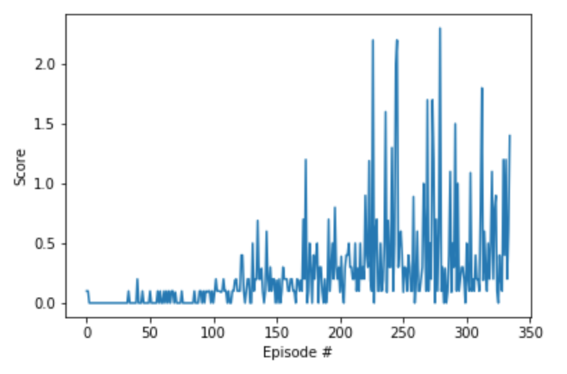

# Project 3 : Collaboration and Competition

## Report

## Learning Algorithm

In this project, we used the Deep Deterministic Policy Gradients ([DDPG](https://arxiv.org/abs/1509.02971)) learning algorithm to solve the Tennis environment. DDPG is an off-policy model-free algorithm that uses neural networks to learn policies, even in high-dimensional and continuous action spaces. The implementation has two DDPG agents with shared actor and critic networks. Each agent uses the same actor network to take an action, sampled from a shared replay buffer. Both actor and critic have three fully connected layers: hidden layers of 500 and then 375 units, each with ReLU activation, and an output layer (of 2 units for the actor, with tanh applied in order to bound the output between -1 and 1, and of 1 unit for the critic). In addition, in the critic network, the action vector is included between the first and second hidden layers. The hyperparameters are as follows:

| Hyperparameter | Value |
| ------------- | ------------- |
| first hidden layer units | 500 |
| second hidden layer units | 375 |
| replay buffer size | 1e5 |
| batch size | 128 |
| discount factor (gamma) | 0.99 |
| tau* | 3e-1 |
| actor learning rate | 1e-4 |
| critic learning rate | 1e-4 |
| number of episodes | 5000 |
| L2 weight decay | 0 |

*Tau is the percentage of weights from the local model to carry over to the target model during the soft update of target parameters; meanwhile, `1 - tau` is the percentage of target model weights to carry over.

## Results

| Trial | # of Episodes to Solve | Description | Comments |
| ------------- | ------------- | ------------- | ------------- |
| Initial Run | 518 | Default params with tau 1e-2, batch size 128, and critic LR 1e-3 | Baseline [Reacher] code with a change to tau |
| Trial 1 | 840 | Tau 1e-3 | Not better than Initial Run|
| Trial 2 | 666 | Tau 1e-1 | Better than Trial 1 but not better than Initial Run |
| Trial 3 | 411 | Tau 5e-1 | Better than Trail 1 and Initial Run |
| Trial 4 | 480 | Tau 3e-1 | Not better than Trial 3 |
| Trial 5 | 536 | Tau 4e-1 | Not better than Trial 4 |
| Trial 6 | 998 | Tau 2e-1 | Not better than Trial 5 |
| Trial 7 | 728 | Tau 3e-1 and batch size 256 | better than Trial 6 but not better than Trial 3 |
| Trial 8 | 335 | Tau 3e-1 and batch size 512 | Best results so far|
| Trial 9 | 416 | Tau 3e-1 and batch size 1024 | Not better than Trial 8 |
| Trial 10 | 596 | Tau 3e-1 and batch size 64 | Not better than Trial 9 |
| Trial 11 | 611 | Tau 3e-1 and batch size 128; actor LR 1e-3 | PNot better than Trial 10 |
| Trial 12 | 685 | Tau 3e-1 and batch size 128; actor LR 1e-2 and critic LR 1e-2 | Not better than Trial 11 |
| Trial 13 | 868 | Tau 3e-1 and batch size 128; critic LR 1e-4 | Not better than Trial 12 |
| Trial 14 | 391 | Tau 3e-1 and batch size 128; actor LR 5e-5 and critic LR 5e-5 | better than Trial 13 but not better than Trial 8 |

I was able to obtain the best results in Trial 8 by setting paramets Tau 3e-1 and batch size 512 and was able to solve the environment in 335 episods.

## Plot of Rewards

The plot below shows that, after 335 episodes, the agent is able to receive an average reward of 0.5 over the last 100 consecutive episodes.

## Ideas for Future Work

Ideas for improving the agent's performance are as follows:
- Attempt prioritized experience replay and D4PG.
- Add lots of noise at the beginning and then reduce or remove it completely after a certain number of episodes.
- Update the weights multiple times per timestep.
- Implement MADDPG: separate actors, separate centralized critics, and a shared replay buffer.
- Try a variation with: separate actors, one shared centralized critic, and a shared replay buffer.
